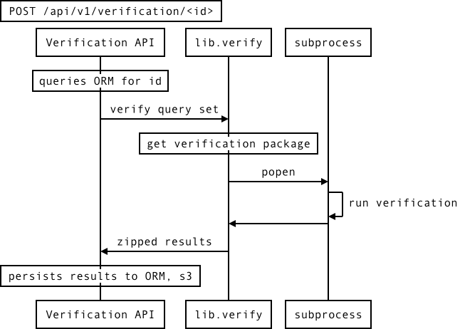

Quickly thrown together diagrams about RC

dia files are rendered by [dia](https://wiki.gnome.org/Apps/Dia) which can export to png.

compendia_tables.dia

contains simplified descriptions of a subset of our db tables that pertain to research compendia.

simplelayers.dia

contains simplistic picture of layers that show a web browser or api client on top of nginx which would pass requests on to gunicorn django workers. We currently run three gunicorn workers and have 3 nginx processes. I'm not sure if this diagram is helpful.

sequence diagrams are my favorite, and this is a simplified sequence of what happens when someone makes a request.

simple\_verification\_sequence.txt websequencediagram syntax renderable via [js-sequence-diagrams](http://bramp.github.io/js-sequence-diagrams/) which can export to svg which can be rendered via inkscape.

