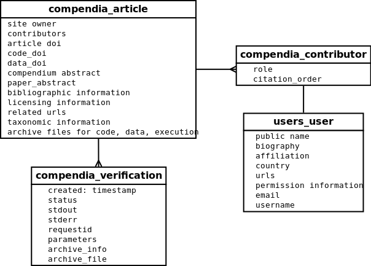
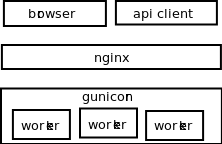
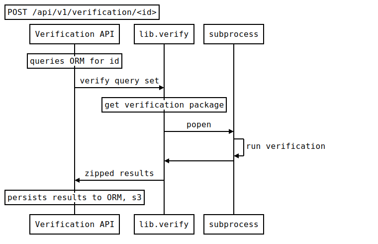

Quickly thrown together diagrams about RC

compendia_tables.dia

simplelayers.dia

simple\_verification\_sequence.txt websequencediagram syntax renderable via [js-sequence-diagrams](http://bramp.github.io/js-sequence-diagrams/)

